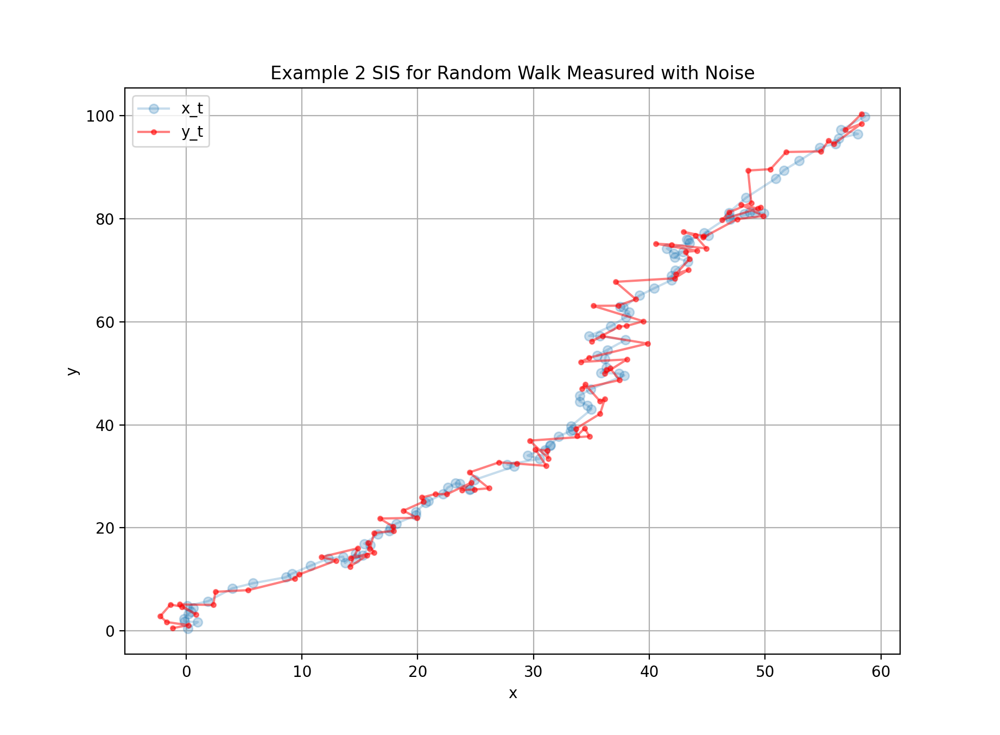

\tableofcontents 

# Particle Filters

## Introduction

Consider a discrete time system of states $\mb{x}_t$ which evolves according to a dynamic
model

\eq{ \mb{x}_t = m(\mb{x}_{t-1}, \epsilon_t) }

where $\epsilon_t$ is a random variable representing uncertainty associated with $\mb{x}_t$
at time $t$.  These states are not directly observed, but instead we have a sequence 
of observations $\left\{ y_1, y_2, \hdots, y_t \right\}$ which were generating **using** the
states according to 

\eq{ \mb{y}_t = h (\mb{x}_t, \eta_t) }

where $\eta_t$ is a random variable describing measurement uncertainty (or some other type
of uncertainty contained in the observation sequence).  Both $\mb{x}_t$ and $\mb{y}_t$ are
vector variables in general but the boldface will be ommitted for clarity until it is needed.
The sequences $\left\{x_1, x_2, \hdots, x_t \right\}$ and $\left\{y_1, y_2, \hdots, y_t\right\}$
are ordered (ie $y_2$ was observed *before* $y_3$ and are referred to using the following index 
notation $x_{1:t}=\left\{x_1, x_2, \hdots, x_t\right\}$ and similar for $y$.  Finally, the 
state sequence is appended with an initial condition $x_0$ and $p(x_0)$ which is assumed to be known.

The fundamental problem in the context of estimation and forecasting is to calculate at time $t$:

* $p(x_t | y_{1:t-1})$ ie our belief about the current state $x_t$ **prior** to recieving a 
 contemporaneous observation $y_t$
* $p(x_t | y_{1:t})$ ie our belief about the current state $x_t$ **after** receiving a current 
observation $y_t$

Iterative Monte Carlo technique are required for solving the integrals that arise when computing 
these quantities in the Bayesian context.  In the case where the transitions are linear and Gaussian 
the recursions derived can be solved analytically - these are the Kalman Filter solutions.  More 
generally specialised numerical techniques are required.  

The following equations are deliberatively recursive so that they can be updated online.  To
derive them the *probability chain rule* (or telescope rule) is used extensively ie
\eqa{
    p(x_1, x_2, \hdots, x_n) = & p\left(x_n|x_{n-1}, \hdots, x_1 \right) p \left(x_{n-1},\hdots,x_0 \right)\nonumber \\
                             = & p\left(x_n|x_{n-1}, \hdots x_1\right) p \left(x_{n-1}|x_{n-2},\hdots,x_0 \right)p\left(x_{n-2},\hdots,x_1 \right) \nonumber \\
                             = & p\left(x_n|x_{n-1}, \hdots x_1\right) p \left(x_{n-1}|x_{n-2},\hdots,x_0 \right) \hdots p \left(x_2|x_1 \right) p \left( x_1 \right) \nonumber
}

## Inference, Estimation and Forecasting

The two distributions $p(x_t | y_{1:t-1})$ and $p(x_t | y_{1:t})$ are computed using a system 
of non-linear equations that are quickly derived from the state equations

\eqa{ 
    x_t = & m (x_{t-1}, \epsilon_t) \nonumber \\
    y_t = & h (x_t, \eta_t) 
}

and a couple of probability identities.  First consider $p(x_t | y_{1:t-1})$ which represents
our **prior** for $x_t$ before recieving $y_t$:
\eqa{
    p(x_t|y_{1:t-1}) = & \int p(x_t | x_{t-1}, y_{1:t-1}) p(x_{t-1}|y_{1:t-1}) d x_{t-1} \nonumber \\
        = & \int p(x_t | x_{t-1}) p(x_{t-1}|y_{1:t-1}) dx_{t-1}
}
where in the last line we used $p(x_t|x_{t-1}, y_{1:t-1})=p(x_t|x_{t-1})$, noting that this does 
*not* mean that $x_t$ is independant of the history $y_{1:t-1}$, but rather that the history $y_{1:t-1}$ 
is redundant when the prior state $x_{t-1}$ is known.  Also, we marginalise over $x_{t-1}$ in
the first line, but note that we need to condition on the history $y_{1:t-1}$ when integrating
out $x_{t-1}$, ie the $p(x_{t-1}|y_{1:t-1})$ term.

After receving $y_t$ we want to update and calculate $p(x_t|y_{1:t})$ which is done as follows:
\eqa{
    p(x_t|y_{1:t}) = & \frac{p(x_t, y_{1:t})}{p(y_{1:t)}} \nonumber \\
     = & \frac{p(y_t|x_t,y_{1:t-1}) p(x_t, y_{1:t-1})}{ p(y_t|y_{1:t-1})p(y_{1:t-1})} \nonumber \\
     = & \frac{p(y_t|x_t,y_{1:t-1}) p(x_t|y_{1:t-1})p(y_{1:t-1})}{ p(y_t|y_{1:t-1})p(y_{1:t-1})} \nonumber \\
     = & \frac{p(y_t|x_t,y_{1:t-1}) p(x_t|y_{1:t-1})}{ p(y_t|y_{1:t-1})} \nonumber
}
In the denominator marginalise over $x_{t-1}$ in a similar way to what we we did in the prior 
distribution ie
\eqa{
    p(y_t|y_{t-1}) = & \int p(y_t|x_t, y_{1:t-1}) p(x_t|y_{1:t-1}) d x_t \nonumber \\
                = & \int p(y_t|x_t) p(x_t | y_{1:t-1}) d x_t \nonumber
}
where we used $p(y_t|x_t,y_{1:t-1})=p(y_t|x_t)$ again.  Combining this result in the denominator 
with our previous prior we have the required system of equations:
\eqa{
          p(x_t|y_{1:t-1}) = & \int p(x_t | x_{t-1}) p(x_{t-1}|y_{1:t-1}) dx_{t-1} \nonumber \\
         p(x_t|y_{1:t}) = & \frac{ p(y_t|x_t,y_{1:t-1}) p(x_t|y_{1:t-1})}{ \int p(y_t|x_t) p(x_t | y_{1:t-1}) d x_t } \nonumber
}

To demonstrate consider the online inference problem where we first recieve $y_1$ and then $y_2$.  
Our algorithm is as follows.

* Step 1

Prior to any observations $y=\left\{ \right\}$ is an empty set and we are relying on our
initial condition $p_0(x_0)$ which is assumed known.  Our prior is
\eqa{
    p(x_1|\left\{ \right\}) & = \int p(x_1|x_0) p(x_0| \left\{ \right\} ) dx_0 \nonumber \\
    & = \int p(x_1 | x_0) p_0(x_0) dx_0
}
with $p_0(x_0)$ the assumed initial condition and $p(x_1|x_0)$ is determined by the known
system update equations.

* Step 2

On arrival of $y_1$ we update the above prior to calculate $p(x_1|y_1)$ as follows:
\eqa{
    p(x_1|y_1)=\frac{p(y_1|x_1) p(x_1|\left\{ \right\})}{\int p(y_1|x_1) p(x_1|\left\{ \right\}) dx_1}
}
where $p(y_1|x_1)$ is determined by the known system update equations and $p(x_1|\left\{ \right\})$
is the prior we calculated in Step 1 above.

* Step 3 

After receiving $y_1$ and prior to receiving $y_2$ we can again compute a prior 
\eq{
    p(x_2|y_{1:1}) = \int p(x_2|x_1)p(x_1|y_{1:1}) dx_1
}
where $p(x_2|x_1)$ is a system update equation and $p(x_1|y_{1:1})$ was calculated in step 2.

* Step 4

Finally we recieve $y_2$, which we use to update our above prior:
\eq{
    p(x_2|y_{1:2}) = \frac{p(y_{1:2}|x_2) p(x_2|y_{1:1})}{ \int p(y_2|x_2) p(x_2|y_1) dx_2 }
}
where $p(x_2|y_{1:1})$ was the prior from Step 3 above and $p(y_{1:2}|x_2)$ is from the 
system update equations.

This sequence continues.  As a final illustration of the point assume that the dynamics equations
where
\eqa{
    y_t = 2 x_t + \epsilon_t \nonumber \\
    x_t = x_{t-1} + \eta_t \nonumber
}
where $\epsilon_t$ and $\eta_t$ where $\mathcal{N}(0, \sigma^{2}_{\epsilon})$ and 
$\mathcal{N}(0, \sigma^{2}_{\eta})$ so that we have a linear, Gaussian system.  In 
Step 3 for instance we need $p(x_2|x1)$, which we can calculate from the second
equation above as $p(x_2|x_1) = \mathcal{N}(x_1, \sigma^{2}_{\eta})$, and $p(y_2|x_2)$
in Step 4 would be $p(y_2|x_2)=\mathcal{N}(2x_1, \sigma^{2}_{\epsilon})$.

As mentioned earlier in special cases the above system can be solved analyticaly, an
example being the Kalman solution for linear Gaussian systems.  The remainder of these notes
will investigate how to approximate these distributions for general systems.

## Importance and Sequential Importance Sampling

Sequential Importance Sampling (SIS) is the first step on the way to computing the 
difficult integrals arising from the above expressions.  It is an iterative technique for 
computing the joint distribution $p(x_{0:t}|y_{1:t})$.  To get there, first consider the 
standard Importance Sampling Problem.

Given a function $x\in \mathbb{R}$ define the expectation
\eq{
    \mathbb{E}_p \left(f(x) \right) = \int f(x) p(x) dx \nonumber
}
where $\mathbb{E}_p$ denotes expectation with respect to the distribution $p$.  The above
integral may be difficult or impossible to compute when the above integral is not available 
in closed form (or is high dimensional...). Define the estimate 
\eq{
    \widehat{I} = \frac{1}{N} \sum f(x_i)  \qquad x_i \sim p(x) \nonumber
}
where $x_i$ are all $iid$ draws from the distribution $p(x)$ and notice that the estimator
is unbiased
\eqa{
    \mathbb{E}_p \left(\widehat{I}\right) & = \mathbb{E}_p \left( \sum f(x_i) / N \right) \nonumber \\
     & = \frac{1}{N} \cdot N \cdot \mathbb{E}_p \left( f(x) \right) \nonumber \\
     & = \mathbb{E}_p \left( f(x) \right) \nonumber 
}

The problem arises in the situation that 

* we cannot sample $x \sim p(x)$, either because we do not know how or the process required to 
generate samples is prohibitively expensive. Or
* The approximation may exhibit high variance if $x\sim p(x)$ generates a large fraction of samples that
do not contribute greatly to the integral (ie provide much information about the function).   

Instead assume that despite not knowing how to sample from $p(x)$ we can 
still evaluate it, and that we have an importance distribution $g(x)$ with the same
domain as $p(x)$ that is easy to sample from.  Perform the following trick
\eqa{
    \mathbb{E}_p \left(f(X) \right) & = \int f(x) p(x) dx \nonumber \\
     & = \int \frac{f(x) p(x)}{g(x)} g(x) dx \nonumber \\
     & = \int r(x) g(x) dx \nonumber \\
     & = \mathbb{E}_g \left(r(x) \right)
}
to see we can either consider our integral to be a sample average of $f(x)$, where $x$ is 
drawn from $p(x)$ (ie estimate the expectation $\mathbb{E}_p$) or a sample average 
of the new function $r(x)=f(x)p(x)/g(x)$ where $x$ is drawn from the importance 
distribution $g(x)$ (ie estimate the expectation $\mathbb{E}_g)$.  There is much 
to be said about how to choose $g(x)$ which I will gloss over here.  Robert \& Casella (2004)
have a good description and further reading on this topic.

In our context (state space models) the distribution we are required to sample 
from (ie $p(x)$ in this case) is changing at each iteration, which means we are 
constantly having to tune our importance distribution $g(x)$.  Consistent with the
iterative ideas introduced earlier we look for a sequential way to build up these 
distributions - **Sequential Importance Sampling**.  A final point to be made is 
that SIS is focused on the notation of *weights* in the above MC integrals, which
I guess is a third way to interpret the expectation above ie 
\eqa{
    \mathbb{E}_p \left( f(x) \right) & = \int f(x) p(x) dx \nonumber \\
     &= \int \frac{p(x)}{g(x)} f(x) g(x) dx \nonumber \\
     &= \int w(x) f(x) g(x) dx \nonumber \\
     &= \mathbb{E}_g \left(w(x) f(x) \right) \nonumber
}
where $w(x)$ is a weight function representing a reweighting of the integral because
we are taking an expectation with $g(x)$ instead of $p(x)$ as the problem requires.
The estimator for this integral would be 
\eq{
    \widehat{I} = \sum \widehat{w} (x_i) f(x_i)  \qquad x_i \sim g(x)
}
where $w^{*}(x)$ can be either
\eq{
    \widehat{w}(x)=\frac{w(x_i)}{N}
}
or 
\eq{
    \widehat{w}(x)=\frac{w(x_i)}{\sum w(x_i)}
}
although the second form (usually referred to as *self normalising weights*) is more common,
because the former requires the importance distribution $g(x)$ to be known completely
while the latter allows it to be known only up to a multiplicative constant.  In either
case we are *drawing* samples $\left\{ x_i, \; w(x_i)\right\}$ with which we calculate our
weighted averages for estimating integrals.  The Particle Filter literature will refer to
this sample of point-weight pairs $\left\{ x_i, \; w(x_i)\right\}$ as **particles** and their
respective **weights**.

### Example 1: Simple Weighted Points Examples

Here is a simple example where we use a weighted set of particles generated from one distribution
to approximate an other.  Here my importance distribution $q$ is the two dimensional uniform
distribution on $(-4,4)$, and my target $p$ is the bivariate normal with mean zero, variance one
and correlation 0.5.  I am not considering separate state and observation equations so there
is no need for conditioning in these distributions.  I compute weights $w_i$ for each point as 
\eqa{
    w_i = & \frac{p(x_i)}{q(x_i)} \nonumber \\
       = & p(x_i) \nonumber 
}
leaving out the uniform normalisation constant $1/64$ as I use normalised weights anyway.  The 
following plot has the uniform importance distribution in red and the target $p(x_i)$ in blue.  
The points are scaled in size based on their weights.

## Sequential Importance Sampling (SIS) for State Space Models

In the state space context we are given a function $f(x_{0:t})$ of our states, and are
computing the expectation
\eq{
    \mathbb{E}(f(x_{0:t})) = \int f(x_{0:t}) p(x_{0:t}|y_{1:t}) dx_{0:t}
}
This integral using MC techniques is desirable because it converts what is likely
to be a difficult integration problem into a summation problem.  This is difficult to 
compute however since $p(x_{0:t}|y_{1:t})$ cannot in general be sampled from.  Consistent 
with the IS approach previously we instead calculate
\eq{
    \mathbb{E}(f(x_{0:t})) = \int f(x_{0:t}) w(x_{0:t}|y_{1:t}) g(x_{0:t}|y_{1:t}) dx_{0:t}
}
where the *importance weights* are
\eq{
    w(x_{0:t}|y_{1:t}) = \frac{ p(x_{0:t}|y_{1:t}) }{ g(x_{0:t}|y_{1:t}) }
}
In practice we draw a set of $N$ point-weight pairs 
$\left\{ x^{i}_{0:t}, \; w(x^{i}_{0:t}|y_{1:t})\right\}$ where $i=1,2,\hdots,N$ and estimate 
the integral as expected
\eq{
    \mathbb{E} \left( f(x_{0:t}) \right) = \sum \widehat{w}^{i}(x_{0:t}|y_{1:t}) f \left( x^{i}_{0:t} \right) 
    \qquad \widehat{w}^{i}(x_{0:t}|y_{1:t})=\frac{{w}^{i}(x_{0:t}|y_{1:t})}{\sum {w}^{i}(x_{0:t}|y_{1:t})}
}
Nothing here is conceptually different to the previous more simple case except we know have lot more 
notation. The task at hand now is to build the (posterior) distribution $p(x_{0:t}|y_{1:t})$ using a MC 
approach, since calculas based approaches are almost certainly going to be infeasible.  
The SIS approach, of which particle filtering is a particular example, is to build up an approximation
to the posterior in an iterative way using the set of $N$ point-weight pairs 
$\left\{ x^{i}_{0:t}, \; w(x^{i}_{0:t}|y_{1:t})\right\}$.  Effectively, we are at each point in time
approximating the posterior as a summation:
\eq{
    p(x_{0:t}|y_{1:t}) = w_{0:t}^{i} \delta (x_{0:t}-x_{0:t}^{i})
}
where the weights $w$ are carefully constructed in an iterative way discussed below
and the delta function $\delta (x_{0:t}-x_{0:t}^{i})$ represents a point mass at each point in
our sample of point-weight pairs.  At each iteration we have new points and new weights, and these
points create a *trajectory* of $N$ points over time
\eq{
    \left\{ x_0 \right\}_{1}^{N} \rightarrow \left\{ x_{0:1} \right\}_{1}^{N} 
    \rightarrow \hdots \rightarrow \left\{ x_{0:t} \right\}_{1}^{N}
}
Again, the notation in the weight for example $w_{0:t}^{i}$ signifies that for sample $i$ the weight 
function at time $t$ is built from data all the way from $t=0$ to $t$, and similar for the $x$ above.  
The challenge remains to work out:

* how to move our samples between iterations (ie generate $x_t$ using information from $t-1$)
* how to update weights $w_{t}^{i}$ using information from $t-1$.

To proceed write the posterior $p(x_{0:t}|y_{1:t})=p(x_{0:t},y_{1:t})/p(y_{1:t})$ and expand
using the chain rule repeatedly to expose transition distributions like $p(y_t|x_t)$ and 
$p(x_t|x_{t-1})$ as follows:
\eqa{
    p(x_{0:t}|y_{1:t})=& \frac{p(x_{0:t},y_{1:t})}{p(y_{1:t})} \nonumber \\
     =& \frac{p(y_t|y_{1:t-1},x_{0:t})p(x_t|y_{1:t-1},x_{0:t-1}) p(y_{1:t-1},x_{0:t-1})}{p(y_t|y_{1:t-1})p(y_{1:t-1})} \nonumber \\
     =& \frac{p(y_t|y_{1:t-1},x_{0:t})p(x_t|y_{1:t-1},x_{0:t-1})p(x_{0:t-1}|y_{1:t-1})p(y_{1:t-1})}{p(y_t|y_{1:t-1})p(y_{1:t-1})} \nonumber \\
     =& \frac{p(y_t|y_{1:t-1},x_{0:t})p(x_t|y_{1:t-1},x_{0:t-1})p(x_{0:t-1}|y_{1:t-1})}{p(y_t|y_{1:t-1})} \nonumber \\
     \rightarrow p(x_{0:t}|y_{1:t}) =& K_{t-1,t}  p(x_{0:t-1}|y_{1:t-1})
}
where the kernal $K_{t-1,t}$ is defined 
\eq{
    K_{t-1,t} = \frac{p(y_t|y_{1:t-1},x_{0:t})p(x_t|y_{1:t-1},x_{0:t-1})}{p(y_t|y_{1:t-1})} 
}
and is the way the posterior updates from $t-1$ to $t$.  The recursive nature of the problem is clear.  Also, the
notation can be simplified further using
\eqa{
    p(y_t|y_{1:t-1},x_{0:t}) &= p(y_t|x_t) \nonumber \\
    p(x_t|y_{1:t-1},x_{0:t-1}) &= p(x_t|x_{t-1}) \nonumber
}
to write
\eq{
    K_{t-1,t} = \frac{p(y_t|x_t)p(x_t|x_{t-1})}{p(y_t|y_{t-1})} 
}
Combine the usual expression for the weight function with our iterative importance function above to first write
\eqa{
    w(x_{0:t}|y_{1:t}) =& \frac{p(x_{0:t}|y_{1:t})}{g(x_{0:t}|y_{1:t})} \nonumber \\
     =& \frac{p(x_{0:t}|y_{1:t})}{g(x_t|x_{0:t-1},y_{1:t})g(x_{t-1}|y_{1:t-1})} \nonumber \\
     =& \frac{p(x_{0:t}|y_{1:t})}{g(x_t|x_{t-1},y_t)g(x_{t-1}|y_{1:t-1})}
}
where the denominator is equation (10) in Creale (2009), but I dont understand how the second expression
is condition on $y_{1:t-1}$ and not $y_{1:t}$.  Substitute for $p(x_{0:t}|y_{1:t})$ using the expression
with the kernal $K_{t-1,t}$ above and simplify
\eqa{
    w(x_{0:t}|y_{1:t}) &= \frac{p(x_{0:t}|y_{1:t})}{g(x_t|x_{t-1},y_t)g(x_{0:t-1}|y_{1:t-1})} \nonumber \\
 &=  \frac{K_{t-1,t}  p(x_{0:t-1}|y_{1:t-1})}{g(x_t|x_{t-1},y_t)g(x_{t-1}|y_{1:t-1})} \nonumber \\
 &= \frac{p(y_t|x_t)p(x_t|x_{t-1})}{p(y_t|y_{t-1})} \frac{p(x_{t-1}|y_{t-1})}{g(x_t|x_{t-1},y_t)g(x_{t-1}|y_{1:t-1})} \nonumber \\
 &= \frac{p(y_t|x_t)p(x_t|x_{t-1})}{g(x_t|x_{t-1},y_t)p(y_t|y_{t-1})} \frac{p(x_{t-1}|y_{t-1})}{g(x_{t-1}|y_{t-1})} \nonumber \\
 & \propto  \frac{p(y_t|x_t)p(x_t|x_{t-1})}{g(x_t|x_{t-1},y_t)} \frac{p(x_{t-1}|y_{t-1})}{g(x_{t-1}|y_{t-1})} \nonumber \\
 \rightarrow w(x_{0:t}|y_{1:t}) =& \widehat{w}_{t-1,t} \cdot w_{t-1}
}
As before $p(y_t|x_t)$ and $p(x_t|x_{t-1})$ come from the known system equations.  In the denominator the second last 
equation the $p(y_t|y_{t-1})$ term was dropped and the expression reduced to one of proportionality.  This can be
done as we use self-normalising weights but I'm not sure the exact reason for this but I presume the reasoning is the
same as a usual Bayesian statement that $p(A|B)\propto p(B|A)p(A)$ where the denominator is hard to calculate and
in general is not needed.

How do we use this all in practice.  Remember we are trying to construct a sequence:
\eq{
    \left\{ x_0 \right\}_{1}^{N} \rightarrow \left\{ x_{0:1} \right\}_{1}^{N} 
    \rightarrow \hdots \rightarrow \left\{ x_{0:t} \right\}_{1}^{N}
}
where at each time point are point-weight samples $\left\{x_{0:t}, w_{0:t} \right\}$ are sampled 
from our importance distribution $g$ using the sequential form
\eq{
    g(x_{0:t}|y_{1:t})=g(x_t|x_{0:t-1},y_{1:t})g(x_{0:t-1}|y_{1:t-1})
}
The second term $g(x_{0:t-1}|y_{1:t-1})$ is a sum of delta functions centred at each
point in our sample at time $t-1$ ie $\left\{ x_{0:t-1}\right\}_{1}^{N}$, and the first term 
$g(x_t|x_{0:t-1},y_{1:t})$ is the distribution we draw from to construct our new sample 
$\left\{ x_{0:t}\right\}_{1}^{N}$.  With these new points we recompute their respective weights
using
\eq{
    w(x_{0:t}|y_{1:t}) = \widehat{w}_{t-1,t} \cdot w_{t-1}
}
where points where with large $\widehat{w}_{t-1,t}$ ie
\eq{
    \widehat{w}_{t-1,t}=\frac{p(y_t|x_t)p(x_t|x_{t-1})}{g(x_t|x_{t-1},y_t)}
}
occurs when $p(y_t|x_t)p(x_t|x_{t-1})$ are large.  This is as expected - we generated the $x_t$ 
from a importance distribution $g$ but we should assign large weights to samples where these 
transitions $p(y_t|x_t)$ and $p(x_t|x_{t-1})$, both of which are determined by the system
dynamics, were most likely.  At this point we are in a similar position to standard IS:
\eq{
    \mathbb{E}\left( f(x_{0:t}) \right) = \sum \widehat{w}_{t}^{i} f \left (x_{0:t}^{i} \right)
    \qquad \widehat{w}_{t}^{i} = \frac{w_{t}^{i}}{\sum w_{t}^{i}}
}
and the posterior itself is estimated as 
\eq{
    p(x_{0:t}|y_{1:t}) = \sum \widehat{w}_{t}^{i} \delta (x_{0:t}-x_{0:t}^{i})
}

From here we have not spoken about two main points:

* What determines good choices of importance distribution $q$?
* Do we run into issues with this process after many iterations?

### Example 2: SIS Filter for a Random Walk Measured With Noise

Consider the following simple state space model:\
\eqa{
    x_t = & \mu + x_{t-1} + \eta_t \qquad \eta_t \sim \mathbb{N}\left(0,\Sigma_\eta\right) \nonumber \\
    y_t = & x_t + \epsilon_t \qquad \epsilon_t \sim \mathbb{N}\left(0, \Sigma_\epsilon\right) \nonumber
}
where the state $x_t = \left[x_{1,t}, x_{2,t} \right]$ is a random walk
in two dimensions with drift.  It is measured $y_t \in \mathbb{R}^2$ with noise represented by 
$\Sigma_\epsilon$.   The code for this example is in \verb|scripts/ex2.py|. A sample trajectory is plotted 
below.  Remember in a practical application the state path $x_t$ (blue points) is not observed, instead only 
the observations $y_t$ are known (red points).

To apply the SIS filter choose importance density $g(x_t|x_{0:t-1}, y_{1:t})=p(x_t|x_{t-1})$,
which from the state equations is simple
\eq{
    p(x_t|x_{t-1}) \sim \mathbb{N}\left( \mu + x_{t-1}, \eta_t\right)
}
and this choice simplifies the weight calculation dramatically
\eqa{
    w_t = & \widehat{w}_{t-1,t} \cdot w_{t-1} \nonumber \\
     = & \frac{p(y_t | x_t) p(x_t | x_{t-1})}{g(x_t|x_{t-1})} \cdot w_{t-1} \nonumber \\
     = & p(y_t|x_t) \cdot w_{t-1}
}
Both simulation of points and updates of their weights are trivial in this case.  For
our initial point distribution I will take a bivariate uniform, to represent ignorance
as to the location of $x_0$.  Plotted below is the uniform initial condition (green points)
and the first set of generated points (blue points).  The green points have uniform weight
and the blue are sized in proportion to their new weight.

After 30 iterations I find that the filter is tracking the observations reasonably well,
however I observe that $w_{30}=0$ at all points except one (point in black in plot below).
The green points are the initial condition, the red points are the observed path, and 
the blue points (plotted with uniform size which in this case is **not** representative
of their weight) are the final points.  The black point, which has $w=1$ is totally *feasible* 
but the rate at which it accumulated all weight is suprising.  However in the example
in ElfringEtAl(2021) they describe 50% of points having zero weight after one iteration, and 
after five iterations all weights are zero except for one point.  This is **very** similar to
what I observer, so I think I'll just assume for now that what I've done is correct.  I will 
move on and try and learn some more basics.

## Final Thoughts For Now

At this point we have looked at basic SIS Filter and written code for a simple example.
I think I get the idea and I want to move on.  We have also come across a couple of the 
issues described nicely by Elfring Et Al (2021).  I will just list them here:

* **Degeneracy** is the term given to the phenomenon found above where a tiny number
of points accumulate all weight.  This leads to the point-weights providing very little
information about the desired posterior, and estimated quantities will have high variance.
Also, a huge fraction of computational work (recalcing weights) is wasted, as they are 
basically zero anyways.  A solution is *resampling*, which we will look at later.  An SIS 
filter with resampling are referred to as SISR.

* **Impoverishment** is the flipside to standard fixes for degeneracy.  In 
resampling, we duplicate (with appropriate state noise) points with high weight and 
remove low weight points.  This prevents degeneracy.  However, if the state model
variance is small we will end up with large numbers of `essentially` the same point.
The results will be similar to the problem of degeneracy.

* **Divergance** is a catch-all expression for a range of problems resulting in the 
filter's inability to track the system generating the observations.  See ElfringEtAl(2021)
for a discussion of this point.

* **Choosing g()** remains an obvious problem.  The choice made above $g=p(x_t|x_{t-1})$
is a good one, but it is probably not possible in many cases.  In that case, what to do?